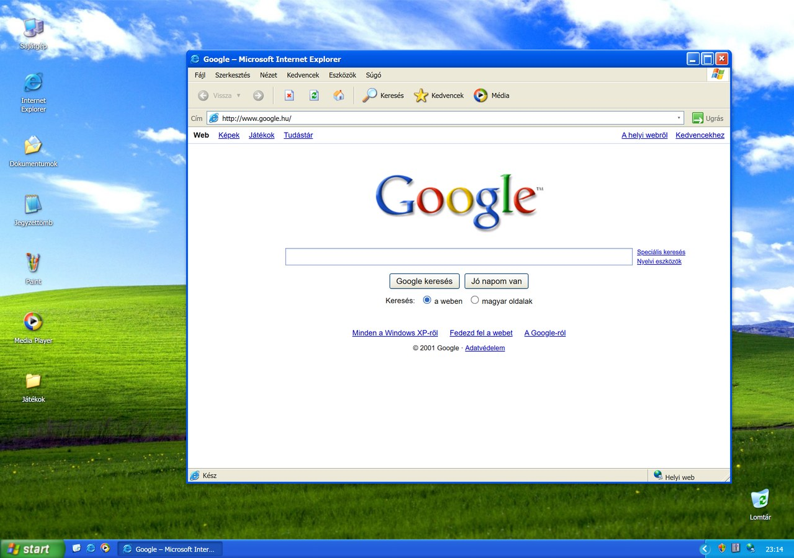

# Windows XP szimulátor

Függőségek nélküli, magyar nyelvű Windows XP-élmény HTML, CSS és JavaScript használatával.

**[Live demo – próbáld ki a böngészőben](https://szabolevi98.github.io/windows-xp/)**

## Indítás

Az `index.html` közvetlen megnyitása is működik. A mentések az adott böngészőhöz és címhez tartoznak; következetesen ugyanazon a címen használd. Nincs build, npm-telepítés vagy CDN.

## Használat

- XP betöltés, üdvözlés, kijelentkezés, készenlét, kikapcsolás, újraindítás.
- Rácsra igazodó asztali ikonok, ütközéskor helycsere. A Lomtár alapból jobb alul jelenik meg, szabadon áthelyezhető, és megjegyzi a helyét.
- Játékok mappa az asztalon, benne az Aknakereső, a Pasziánsz, a FreeCell, a Pókpasziánsz, a Hearts és a 3D Pinball – Space Cadet parancsikonja.
- Mozgatható ablakok: bármelyik szélüknél és sarkuknál átméretezhetők, a bal és a felső élnél húzva együtt mozdulnak. Teljes méret, kis méret, tálca, Start menü, helyi menük.
- Tálca: gyorsindítás az Asztal megjelenítése gombbal, futó ablakok, értesítési terület órával, hangerővel, hálózattal és biztonsági központtal. A « gomb kinyitja a rejtett ikonokat.
- Internet Explorer: régi Google, kulcsszavas helyi keresés, 13 beépített oldal, címsor, előzmények, kedvencek. Az ismeretlen címek helyi hibaoldalt kapnak. A `www.jatekbarlang.hu` oldalról mind a hat játék elindítható.
- Jegyzettömb: piszkozat, dokumentummentés, automatikus mentés, keresés, sortörés, szövegfájl letöltése.
- Fájlkezelő: saját mappák, dokumentumok, képek, átnevezés, törlés, visszaállítás, Lomtár, fájlkeresés.
- Böngészhető, csak olvasható C: meghajtó: WINDOWS, Program Files, Documents and Settings, Temp és almappák. A DVD-meghajtó kattintásra lemezt kér.
- Paint: ceruza, ecset, radír, kitöltés, vonal, téglalap, ellipszis, szöveg, pipetta, paletta, visszavonás, PNG-mentés és letöltés.
- Számológép: alapműveletek, százalék, gyök, reciprok, memória, billentyűzet.
- Aknakereső: két nehézség, biztonságos első lépés, zászló, számláló, időmérő, eredmények.
- Klondike Pasziánsz: szabályos lépések, lapcsoportok, gyűjtőhelyek, újraosztás, visszavonás, automatikus gyűjtés.
- FreeCell: az eredeti, számozott leosztások (a 617-es játék itt is a 617-es), négy szabad hely, több lap együttes mozgatása, automatikus gyűjtés, visszavonás és nyerési statisztika.
- Pókpasziánsz: egy, két vagy négy színnel, tíz oszlop, osztás a pakliból, kész sorok levétele és az eredeti 500 pontról induló pontozás.
- Hearts: három gépi ellenfél, lapátadás balra/jobbra/szemközt, treff 2 kezd, pikk dáma 13 pont, „lövés a Holdra”, 100 pontig tartó játszma.
- 3D Pinball – Space Cadet: az eredeti asztal helyben futó WebAssembly-portja. Karok, kilövés, asztallökés billentyűzetről vagy érintőgombokkal, XP-menü, szünet, hangerő a rendszerbeállításból, helyben mentett rekordok.
- Windows Media Player: eredeti rendszerhangok, saját helyi hangfájlok, lejátszás, szünet, keresés a hangban, hangerő.
- Megjelenítés tulajdonságai: az eredeti öt fül – Témák, Asztal, Képernyőkímélő, Megjelenés, Beállítások. Háttérkép elhelyezéssel (nyújtott, középre, mozaik), három színséma, és két működő képernyőkímélő, amely a megadott tétlenség után magától elindul.
- Rendszertulajdonságok: saját ablak Általános, Számítógépnév, Hardver, Speciális és Automatikus frissítések fülekkel. A számítógépnév átírható, az automatikus frissítések kapcsolója ugyanaz, amit a Biztonsági központ mutat.
- Felhasználói fiókok: a fiók neve, képe és típusa itt módosítható. A név és a kép a bejelentkezési képernyőn és a Start menüben is megjelenik.
- Hangok és audioeszközök tulajdonságai: hangerő, hangséma és a rendszeresemények hangjai, egyenként meghallgatva.
- Vezérlőpult: az eredeti kategórianézet tíz kategóriával, mellette klasszikus nézet a tizennégy különálló beállítással. Eszköztár, címsor és kék feladatpanel, mint a fájlkezelőben; a választott nézet megmarad. Innen érhető el a háttérkép, a színséma, a felhasználónév, a rendszerhangok, a hangerő, a rendszerinformáció és a naptár.
- Biztonsági központ: lenyíló tűzfal-, frissítés- és vírusvédelem-panelekkel. A tűzfal és az automatikus frissítések ki-be kapcsolhatók, és az állapotuk mentődik. A tálca pajzsikonjáról, a Vezérlőpultból és a `wscui` paranccsal is megnyitható.
- Parancssor és Futtatás. `help` megmutatja a támogatott parancsokat.

Az asztalon dupla kattintás nyitja meg az ikonokat. Érintőképernyőn egy koppintás is elég. F11: a valódi böngésző teljes képernyője; az asztal helyi menüjéből is kérhető.

## Mentés és helyi működés

A `windows-xp-simulator-v1` localStorage-kulcs tartalmazza a dokumentumokat, mappákat, képeket, piszkozatokat, beállításokat, kedvenceket, ikonpozíciókat, valamint az Aknakereső-, FreeCell- és Space Cadet-eredményeket. A megnyitott ablakok és a folyamatban lévő játékok nem mentődnek.

Ha a helyi tárhely nem elérhető vagy megtelt, a program figyelmeztet. A böngészőadatok törlése a mentéseket is törli. A fontos dokumentumok és képek a saját gépre is letölthetők. A Media Playerben megnyitott saját hangok csak az aktuális munkamenetben érhetők el.

Minden futtatáshoz szükséges fájl az `assets` mappában van. A CSP tiltja a hálózati API-hívásokat, a külső erőforrásokat és a formok külső beküldését; iframe-et kizárólag saját forrásból enged, ezen keresztül fut a Space Cadet. Az Internet Explorer a DOM-ba renderel helyi tartalmat, nem tölt be valódi weboldalakat.

## Fájlok

- `index.html`: alkalmazásváz és betöltési képernyők.
- `styles.css`: klasszikus Luna felület és programok.
- `js/core.js`: ablakkezelés, menük, párbeszédablakok, mentés, fájlműveletek.
- `js/internet.js`: helyi web és Internet Explorer.
- `js/apps.js`: dokumentumok, Paint, Számológép, parancssor.
- `js/explorer.js`: fájlkezelő, csak olvasható rendszermappák, C: és D: meghajtó.
- `js/utilities.js`: beállítások, Media Player és további eszközök.
- `js/games.js`: Aknakereső és Pasziánsz.
- `js/cardgames.js` és `cardgames.css`: FreeCell, Pókpasziánsz és Hearts. A szabályok DOM nélküli függvényekben vannak, ezért teljes leosztások tesztelhetők.
- `js/pinball.js` és `pinball.css`: a Space Cadet ablaka, menüje és vezérlői.
- `assets/pinball/`: a játék helyi WebAssembly-csomagja és beágyazó oldala.
- `js/desktop-grid.js`: ikonrács, foglalt helyek kezelése és átrendezés.
- `js/start.js`: asztal, Start menü és munkamenet.

## Képek és hangok forrása

Eredeti XP-s képi és hangelemeket töltöttünk le; nincs generált helyettesítő háttérkép vagy ikon. A források fájlonként az `assets/sources.json` fájlban szerepelnek.

- [Windows UI assets – bartekl1](https://github.com/bartekl1/windows-ui-assets): eredeti Windows XP hátterek, hangok, Lomtár-ikon.
- [winXP – ShizukuIchi](https://github.com/ShizukuIchi/winXP): XP programikonok, eszköztárikonok és Aknakereső-elemek.
- [Google régi logó](https://www.google.com/intl/en_ALL/images/logo.gif).
- [JS Paint](https://github.com/1j01/jspaint): eredeti megjelenésű klasszikus Paint-eszközikonok.
- [Pranx Bliss háttérkép](https://pranx.com/images/background.jpg): 1920×1200-as helyi háttérkép (`bliss-hd.jpg`).
- [Azul](https://i.imgur.com/tLLKmd8.jpg) és [Autumn](https://4kwallpapers.com/nature/windows-xp-autumn-17201.html): kész, 1920×1200-as változatok helyi másolatai (`azul-1920.jpg`, `autumn-1920.jpg`), helyi átméretezés nélkül. A Bliss is 1920×1200-as. A kék, logós Windows XP háttér egyelőre az eredeti 800×600-as fájl.
- [XPIcons – Software History Society](https://github.com/softwarehistorysociety/XPIcons): a FreeCell, a Pókpasziánsz, a Hearts, az Asztal megjelenítése és a Biztonsági központ eredeti ikonja nagy felbontásban (Unlicense). Ezek 1024 × 1024-es fájlok, a böngésző kicsinyíti őket.
- [3DPinballSpaceCadet – lrusso](https://github.com/lrusso/3DPinballSpaceCadet): a Space Cadet böngészős WebAssembly-csomagja, [alula](https://github.com/alula/SpaceCadetPinball) és [k4zmu2a](https://github.com/k4zmu2a/SpaceCadetPinball) MIT licencű motorjából; innen származik a játék ikonja is. Részletek: `assets/pinball/NOTICE.md`.
- Vizuális referencia: [Pranx Windows XP Simulator](https://pranx.com/windows-xp-simulator/).

A Windows XP, az ikonok és hangok a Microsoft tulajdonát képezik; a Bliss fotó Charles O’Rear / Microsoft alkotása, a Google-logó a Google tulajdona. A Space Cadet és a hozzá tartozó képi és hangelemek a Cinematronics, a Maxis és a Microsoft tulajdonát képezik; a játékmotor MIT licence ezekre nem terjed ki. A forrásprojektek nem ruházzák át a harmadik felek védjegy- és szerzői jogait. Ez egy független nosztalgikus bemutató, a programkód saját megvalósítás.

Minden eszközfájl a repóban van, így a szimulátorhoz semmit nem kell letölteni. Az `assets/sources.json` soronként megadja, melyik fájl honnan származik és mekkora; ahol a letöltött képet utólag alakítottuk (a profilképek BMP-ből, néhány ikon 1024 képpontról kicsinyítve, a Start gomb jobb éle újrarajzolva), azt a bejegyzés `note` mezője írja le.

## Ellenőrzés

`node --test tests/*.test.mjs`

Nyolc regressziós ellenőrzés: ékezetes fájlok mentése és visszatöltése, mappák rekurzív törlése/visszaállítása, helyi keresés, HTML- és fájlnévkezelés, megtelt tárhely, helyi erőforrások és CSP.

Az indítási ellenőrzések vizsgálják az 5,5 másodperces betöltést, a 2 másodperces üdvözlést és a bejelentkezésenként egyszer megszólaló hangot. A hang előre betöltődik. Ha a böngésző oldalfrissítés után tiltja az automatikus lejátszást, az üdvözlőképernyőn megjelenő Bejelentkezés gomb indítja el a hangot és az asztalt együtt. Egy későbbi asztali kattintás nem játssza le újra a hangot.

Nyolc további ellenőrzés fedi le az ikonok alaphelyét, a rácsra igazítást, az ütközéskori helycserét, a Lomtár mozgatását és helyének mentését, az átméretezést, a sok ikont, a korábbi mentések frissítését és a játékparancsikonok indítását. A hangkezelés tesztjei kitérnek az automatikus lejátszás tiltására, a némításra, a ki-be jelentkezésre, az újraindításra és a sikertelen médiafájlra is. Összesen 54 automatikus teszt fut.

A felület ellenőrzései közé tartozik az, hogy a beállítások ott vannak, ahol az XP-ben voltak, hogy a felület sehol nem hivatkozik magára szimulációként, hogy a Vezérlőpult minden kategóriája létező beállításra mutat és a két nézet ugyanazt a készletet fedi le, a Biztonsági központ kapcsolóinak alapértelmezése és mentése, az, hogy a Játékbarlang oldalon minden asztali játékhoz tartozik indítógomb, a párbeszédablakok üzenethez igazodó magassága, az alapértelmezett Adminisztrátor felhasználónév egyszeri átvétele a régi mentésekből, az ablakok minden élről történő átméretezésének alsó mérethatára és az asztal széléhez igazítása, valamint a tálca értesítési területének felépítése.

A kártyajátékok kilenc ellenőrzése lapról lapra összeveti a FreeCell leosztásait az eredeti Microsoft-számozással, méri a több lap mozgatásának korlátját és az automatikus gyűjtés biztonsági szabályát, ellenőrzi a pókpasziánsz 104 lapos csomagját és a kész sorok felismerését, a Hearts nyitását, színkövetését, ütés- és pontszámítását, a „lövés a Holdra” elszámolását, valamint harminc teljes leosztást játszik végig azt vizsgálva, hogy a gépi ellenfelek mindig szabályos lapot tesznek le és megvan mind a 26 pont.

A Space Cadet öt ellenőrzése az indítás forrásellenőrzését és a beállítások visszatöltését, a szüneteltetéskor felengedett gombokat és a némítást, a fókuszvesztéskor elengedett kilövőt, a bezáráskori mentést és az egyszeri hangleállítást, valamint a helyi erőforrásokat és a CSP-t vizsgálja.

A böngészőben külön ellenőrzött folyamatok: betöltés, üdvözlés, Start menü, keresés és helyi hibaoldal, dokumentummentés újratöltéssel, Lomtár-visszaállítás, számolás, Paint-rajzolás és mentés, Aknakereső első lépése és zászlózás, valamint a Space Cadet betöltése, kilövés, szünet, bezárás és újranyitás, továbbá a FreeCell lapmozgatása szabad helyre, a pókpasziánsz osztása és sorépítése, illetve egy teljes Hearts-kör lapátadástól a kör végi pontozásig.
